## 1. 编写目的

通过 tg-example示例项目，帮助用户轻松搭建基于tg-flow 的在线高并发系统。

tg-flow运行时需要加载工作流配置文件，我们的后台管理系统tg-service提供了工作流配置管理和发布的功能，但还在进一步完善中，功能暂未开放。

现阶段如果要快速上手，可以先人工编辑工作流配置文件来使用tg-flow，将来tg-service开源后再通过该系统进行工作流的配置和管理。

## 2. 快速上手

### 2.1 tg-example下载
1. 下载tg-example: git clone git@github.com/didi/tg-example.git

2. 如下图为tg-example示例项目代码:

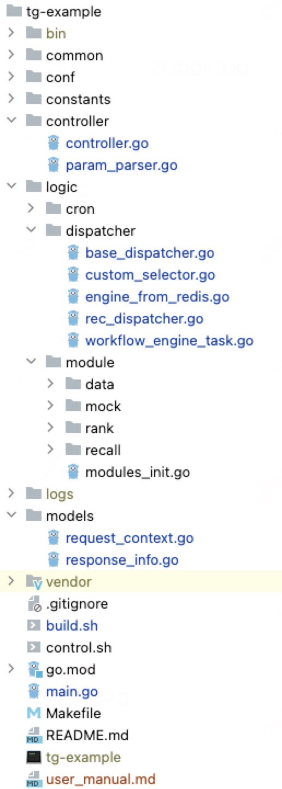

各目录主要功能：
* common：公用库
* conf: 配置文件存放目录，其中工作流配置在conf/workflow目录下（注意workflow子目录下一层目录不得使用“-”）
* constants：常量定义
* controller：接口层
* logic：业务逻辑层
* * cron：定时任务，如：工作流配置定时更新等。
* * dispatcher: 工作流引擎调度执行模块。
* * module：工作流中的各个节点所对应的具体任务的实现。
* * * data/mock/rank/recall: 工作流节点对应的算子实现代码，放到不同子目录分组存放。
* * * modules_init.go：算子注册代码，用于将算子注册到工作流引擎。


### 2.2 工作流算子开发

为便于描述，我们对工作流及相关业务场景进行如下定义：
* 一个应用系统（在线服务）可能有一到多个业务场景。
* 每个场景下可能需要配置一到多个不同的工作流。
* 应用系统对外提供服务时，需要根据实际业务场景或实验分组情况选择使用不同的工作流来执行。
* 工作流则由若干个执行节点组成，每个执行节点对应一个算子，在golang中这些算子对应的是struct。

我们需要在要接入tg-flow的应用系统tg-example中定义这些算子，下面为一个名为QacRecall的算子示例，路径:logic/module/recall/qac_recall.go
其中： QacRecall需要添加一个wfengine.ModelBase为成员，并实现一个DoAction方法，如果该节点设置了超时控制，需要在超时的时候完成某些操作，则需要另外实现OnTimeout方法。

    package recall
    
    import (
        "context"
        "fmt"
        "github.com/didi/tg-example/common/utils"
        "github.com/didi/tg-example/constants"
        "github.com/didi/tg-example/logic/module/mock"
        "github.com/didi/tg-flow/common/tlog"
        utl "github.com/didi/tg-flow/common/utils"
        "github.com/didi/tg-flow/model"
        "github.com/didi/tg-flow/wfengine"
        "time"
    )
    
    type QacRecall struct {
        wfengine.ModelBase
    }
    
    func (q QacRecall) DoAction(ctx context.Context, sc *model.StrategyContext) interface{} {
        defer utl.Recover(ctx, constants.ErrTypeActionPanic)
        //1. 提取请求上下文信息
        reqInfo, err := utils.CheckRequestContext(sc)
        if reqInfo == nil || err != nil {
            errMsg := fmt.Sprintf("%v", err)
            tlog.Handler.ErrorCount(ctx, "utils_check_RequestInfo_err", errMsg)
            sc.Skip(constants.ErrNoOther, errMsg)
            return err
        }
    
        //2. 执行qac召回
        items := mock.MockQacRecall(300)
        sc.Set(constants.ContextkeyQacRecallInfo, items)
    
        fmt.Println(fmt.Sprintf("完成时间=%v ,actionName=%v", time.Now(), q.GetName()))
        return items
    }
    
    //超时回调函数，当DoAction执行时间超过设定的超时时间，会自动触发本函数的执行。
    func (q QacRecall) OnTimeout(ctx context.Context, sc *model.StrategyContext) {
        fmt.Println("execute timeout callback of " + q.GetName())
    }

### 2.3 工作流算子注册

为了将开发好的算子注册到工作流引擎，需要进行算子注册，如下图，我们只需要自己实现一个下面的函数，并在case语句中添加自己的上一步中开发的算子注册代码即可：


    func (moduleObj ModuleObject) NewObj(moduleName string, vMap map[string]string) wfengine.IModelBase {
        switch moduleName {
            ...    
            case QacRecallConst:	return &recall.QacRecall{}
            ...   
       }
       return nil
    }

### 2.4 工作流配置

我们定义了一组配置文件来描述工作流，为便于说明，我们通过示例来说明其语法，工作流配置共包含3种配置文件：
1. 版本配置文件
    
    路径：conf/workflow/version
    
    功能：通常用作当前工作流版本的唯一标识，工作流引擎会通过该文件的取值变化来决定是否加载新版工作流。
    
    格式：通常是工作流配置保存的时间点， 如：2024-09-08 00:56:58

2. 场景配置文件

    路径：conf/workflow/scene.json
    
    功能：用于描述当前系统包括哪些场景，以及每个场景包含哪些工作流配置，以及工作流引擎的工作流选择器。
    
    格式：
    ```go
   {
       "20000": {                                        //场景id
           "id": 20000,                                  //场景id
           "name": "tg-example",                         //场景名  
           "appid": 200,                                 //系统id  
           "bucket_type": 1,                             //分桶依据，0：按流量，1：按用户。
           "slots": null,                                //slotid数组，取值0~99,自定义分桶规则时用。    
           "update_time": "2024-06-30T23:34:28+08:00",   //更新时间
           "flow_type": 1,                               //分桶类型  
           "group_workflows": {                          //分组与工作流id的对应关系  
               "control_group": 10217,
               "treatment_group1": 10218,
               "treatment_group2": 10219,
               "treatment_group3": 10220
           },
           "default_workflow_id": 10219,                //当找不到对应的工作流时默认使用的工作流。        
           "dispatch_experiment_name": "0"              //对场景进行分组实验时指定的实验名称. didi内部用。
       }
   }
   各节点含义：
   20000： 场景id
   id: 场景id
   name：场景名称
   appid：应用系统id
   bucket_type:分桶类型，0：按流量，1：按用户。
   slots: 取值0~99，用于指定分桶编号
   update_time:更新时间
   flow_type: 0:按用户随机分桶，1：使用方自定义分桶。
   group_workflows: 每个分桶名，对应的工作流id。
   default_workflow_id: 当找不到对应的工作流时默认使用的工作流。
    
3. 工作流配置文件

   路径：conf/workflow/tg/workflow-{scene_id}-{workflow_id}-xxx.json

   功能：描述工作流中各个节点的前后依赖关系

   格式：一组由若干个action节点组成的json节点集合，节点取值示例：

   ```json
   "action_type": "task",            //节点类型，总共有4种：task:任务节点，condition:条件节点，flow:子流程节点，timeout：超时节点
   "action_id": "action-10217-6",    //节点id
   "action_name": "recall.EsGeneral", //节点名
   "params": null,                   //参数，包含三个子节点：name、value、type，分别表示参数名、参数值、参数数据类型   
   "next_action_ids": [              //后继节点数组，多个后继节点可以在当前节点执行完后并行执行
       "action-10217-7"
   ],
   "description": "",                //节点描述信息
   "timeout": 50,                    //节点超时时间
   "ref_workflow_id": 0,             //子工作流id
   "timeout_async": false,           //是否异步超时  
   "timeout_dynamic": true,          //是否动态超时
   "location": "262,214"             //节点坐标

其中，配置示例中的workflow-20000-10217-tg-example.json，对应的工作流其节点依赖关系，如下图中间的流程图所示：
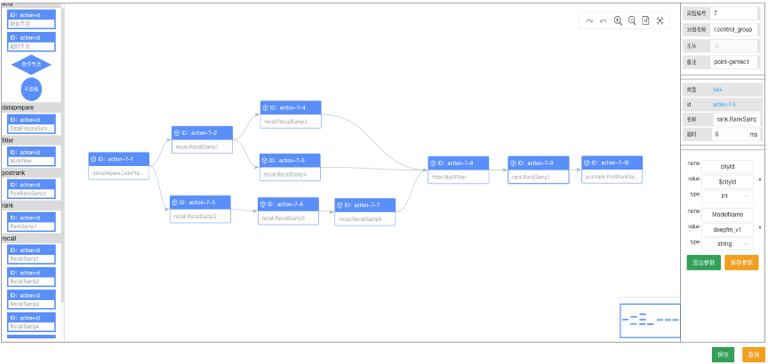

### 2.5 工作流引擎初始化
1. 在服务启动时(main.go)中添加工作流引擎初始化协程： dispatcher.InitWorkflowEngine(context.TODO())

2. 进一步，可以在logic/dispatcher/workflow_engine.go文件中选择一个工作流引擎的初始化方式（注释掉不用的那种即可）：
  * 第一种：通过直接加载本地工作流配置文件的方式来初始化。
  * 第二种：通过加载远程存储服务（如：redis、zookeeper等）中的工作流配置信息来初始化。

3. 更进一步，如果希望在服务中定时检查工作流配置，发现配置更新后立即将配置更新到工作流引擎中，可以在main.go中添加定时任务:  
   go cron.StartCronTask()

### 2.6 工作流引擎调度执行

在线服务中通常会有多个接口，这些接口均要使用工作流引擎，为此我们提供了一个BaseDispatcher(路径:logic/dispatcher/base_dispatcher.go)来作为调度器。
调度器中提供了工作流引擎的调度执行代码示例：

    WorkflowEngine.Run(ctx, sc)
    errMap := sc.GetErrorMap()
    errMap.Range(func(key, val interface{}) bool { 
        tlog.Handler.ErrorCount(ctx, "WorkflowEngine.Run_err", fmt.Sprintf("workflowengine run error, key=%v, val=%v", key, val))
        return true
})

然后，每个接口可以单独定义一个Dispatcher，用组合的方式来继承BaseDispatcher, 如tg-example中的RecDispatcher（logic/dispatcher/rec_dispatcher.go）

### 2.7 启动服务&测试执行
1. 编译项目
   从命令行进入项目tg-example的根目录，执行：go build，如果出现编译错误，请修改，否则说明编译成功。    

2. 启动服务
    在命令行执行：go run main.go
    如果出现类似提示，则说明服务启动成功：[GIN-debug] Listening and serving HTTP on :8080    

3. 测试执行
    打开一个新的命令行窗口，在命令行执行curl命令：curl 'http://127.0.0.1:8080/api/recommend?city_id=11&keyword=kwd&uid=123456&scene_id=20000&is_debug=true'

    如果在新的命令行窗口输出包含若干个推荐结果列表，则说明返回结果正常；如果在启动服务的窗口看到类似下面的打印结果，说明工作流执行成功。
    
    ```
    actionName:data.DataPrepare,	start time:2024-09-17 17:58:28.887715 +0800 CST m=+6.189040071
    actionName:data.DataPrepare,	finish time:2024-09-17 17:58:28.887737 +0800 CST m=+6.189062057
    actionName:recall.EsGeneral,	start time:2024-09-17 17:58:28.887877 +0800 CST m=+6.189201866
    actionName:recall.QacRecall,	start time:2024-09-17 17:58:28.887854 +0800 CST m=+6.189179092
    actionName:recall.HotRecall,	start time:2024-09-17 17:58:28.887979 +0800 CST m=+6.189303562
    actionName:recall.QacRecall,	finish time:2024-09-17 17:58:28.90058 +0800 CST m=+6.201904519
    actionName:recall.HotRecall,	finish time:2024-09-17 17:58:28.909864 +0800 CST m=+6.211188664
    actionName:recall.EsGeneral,	finish time:2024-09-17 17:58:28.930035 +0800 CST m=+6.231359176
    actionName:recall.EsAoi,	start time:2024-09-17 17:58:28.930083 +0800 CST m=+6.231408114
    actionName:recall.EsAoi,	finish time:2024-09-17 17:58:28.930107 +0800 CST m=+6.231431270
    actionName:recall.EsPrecise,	start time:2024-09-17 17:58:28.930118 +0800 CST m=+6.231442560
    actionName:recall.EsPrecise,	finish time:2024-09-17 17:58:28.930127 +0800 CST m=+6.231451232
    actionName:rank.RoughRank,	start time:2024-09-17 17:58:28.930145 +0800 CST m=+6.231470012
    actionName:rank.RoughRank,	finish time:2024-09-17 17:58:28.930184 +0800 CST m=+6.231508991
    actionName:rank.PreciseRank,	start time:2024-09-17 17:58:28.93019 +0800 CST m=+6.231514852
    actionName:rank.PreciseRank,	finish time:2024-09-17 17:58:28.930211 +0800 CST m=+6.231535515
    actionName:rank.ReRank,		start time:2024-09-17 17:58:28.930216 +0800 CST m=+6.231540887
    actionName:rank.ReRank,		finish time:2024-09-17 17:58:28.930242 +0800 CST m=+6.231566883

## 3. 后台管理系统
为了提升用户体验，降低工作流配置管理的成本，我们开发了单独的后台管理系统。由于该系统尚在完善中，暂未开源，下面的部分可先不用关注，敬请期待正式版发布!!!
### 3.1 下载地址

tg-service:（敬请期待）

### 3.2 安装和启动

#### tg-service 的安装和启动：

1.  将 tg-service 软件包拷贝到要安装的目录；
2.  进入 tg-service 目录，执行 `./build.sh`，会生成 output 文件夹；
3.  执行：`cd output` 进入 output
    目录，执行：`nohup ./control.sh start > nohup.log 2>&1 &`，启动服务。
4.  打开浏览器地址栏，输入 <http://localhost:8888/>，可以打开登录页，说明安装成功。

5. 注：tg-flow 是应用系统使用时需要导入的组件，可下载源码学习，但不需要单独安装。

## 3.3 登录

### 3.3.1 账号分配

初次安装时，系统会默认生成一个管理员账号 admin，密码
admin，可以使用该账号进行后续的登录和分配其他子账号。

### 3.3.2 登录系统

第一次打开系统的时候，系统会自动跳转至登录页面，这个时候可以使用管理员账号或者子管理员账号，输入账号、密码、验证码进行登录。

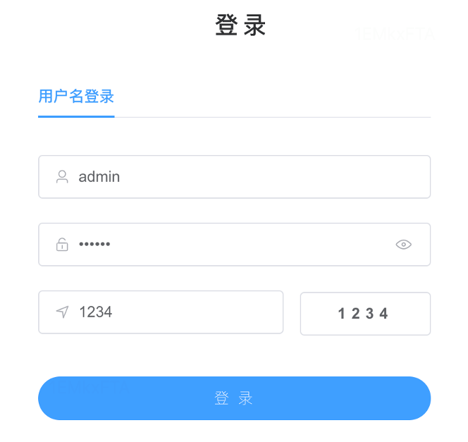

### 3.3.3 注销登录

进入系统后，可以通过点击系统的右上角"退出登录"按钮注销登录。

## 4. 系统管理

tg-flow
支持同时接入并管理多个系统和应用，每个系统都有独立的系统ID和系统名称，通过系统管理页面可以查看当前接入的所有业务系统。
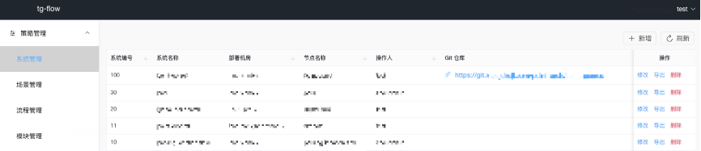

### 图4.1 系统管理界面

属性名称       描述
  -------------- ----------------------------
id             系统 ID
app_name       系统名称
machine_room   系统所部署的集群
node_name      系统所在机房
operator       系统创建和修改人员
create_time    系统创建时间
update_time    系统更新时间
git_url        系统代码所属的代码仓库地址

在策略管理系统管理页面可以进行新增，修改，导出和删除系统等相关操作。
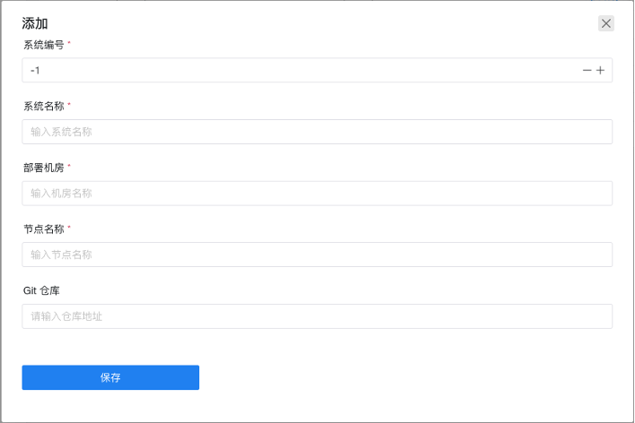

### 图4.2 新增系统对话框

其中系统编号，系统名称，部署机房和节点名称都为必填项，填写完成后点击保存按钮即可完成系统新增。

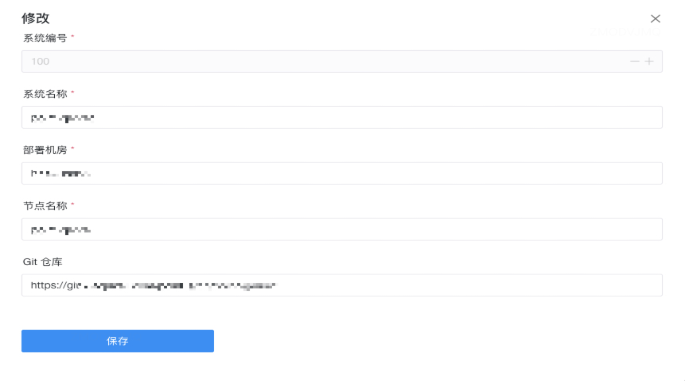

### 图4.3 修改系统对话框

系统条目右侧的导出按钮并点击确认导出可以导出对应系统所有场景下的流程信息，并作为
zip 压缩包的形式下载到本地并用于对应的系统中。

## 5. 场景管理

### 5.1 场景列表

该列表页展示在当前平台注册的所有的场景信息，系统与场景属于一对多的关系。场景信息所含字段如下图所示。搜索栏中可通过输入"场景名称"或者"系统名称"来获取相应的场景信息。

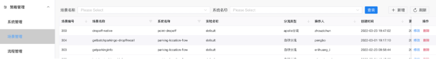

### 5.2 场景配置

场景列表页存在四个可操作按钮：

-   新增：可手动添加某个系统下的场景信息；
-   刷新：手动触发获取最新的场景列表；
-   修改：针对单一场景修改其描述内容，除了场景编号之外其他内容均可修改；
-   删除：删除某个场景；

## 6 高级使用
### 6.6 代码仓库注册

在应用系统中完成上述代码编写后，可以将代码提交到git代码仓库，并将git仓库地址拷贝出来，然后进入系统管理页面，如下图所示，点击"修改"按钮，将该代码仓库的地址填写到弹出层中的"git仓库"文本框，如下图红色矩形框所示，然后点击"保存"按钮即可。

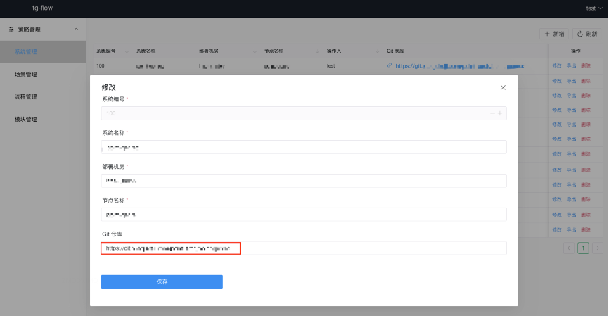

## 7 工作流管理

### 7.1 工作流列表

点击左侧的"流程管理"目录，可以打开流程列表的管理页面，如下图所示。

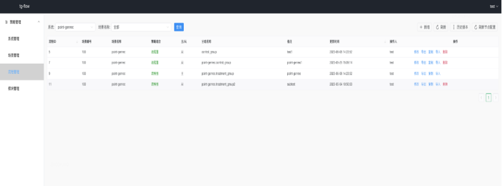

选择列表上方的"系统"下拉框，点击查询，可以查到对应的应用系统已经添加的所有流程。

选择"场景名称"，点击查询，可以列出指定系统及场景下的所有工作流。

点击"新建"按钮，可以打开工作流编辑页面，开始一个新工作流的创建，下节会详细介绍新工作流的编辑功能。

工作流列表中有：修改、导出、复制、导入、删除等5个按钮。

点击"修改"按钮，可以打开工作流编辑页，后面的工作流编辑部分会详细介绍。

点击"导出"按钮，可以将当前工作流配置信息导出为一个json文件，点击确认后可以下载到本地，后面可以拷贝到待接入的应用系统工程目录下，应用系统在启动时，会初始化工作流引擎，工作流引擎初始化时可以通过本地方式加载上述配置。注意：此处是对单个工作流配置进行导出，如果要将某个系统下所有工作流打包导出，则需要进入到系统管理页操作。

点击"复制"按钮，可以新建一个同样的工作流配置，然后后面就可以在这个工作流上进行相关修改并保存。

点击"导入"按钮，会弹出一个对话框，这时可以将在外部编写的工作流配置信息复制并粘贴到这个对话框中的"导入内容（Json）"文本框中，点击"确认"按钮，即可完成工作流配置信息的导入，注意：工作流节点中的action_id的取值格式为：action-{场景ID}-{工作流ID}，导入工作流时如果相关actionId中的场景ID和工作流ID与当前要导入的场景ID和工作流ID不一致，系统会自动帮忙将actionId中的后面两部分的值调整为当前的场景ID和工作流ID。

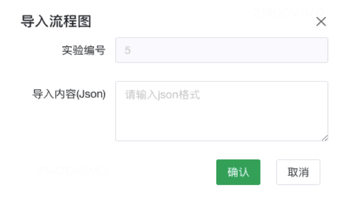

### 7.2 工作流编辑

打开工作流编辑页，系统会自动读取前面配置好的git仓库中的代码模块，获取代码中的算子列表，并在工作流编辑页面的左侧算子列表中展示，供后续的工作流编辑用。(注意：工作流中的条件节点已经在工作流引擎中做了内置的模块实现，所以无需单独在应用层再做实现，当然如果有需要，也可以自定义条件节点后，注册到工作流引擎)。如下图，为工作流编辑页面。工作流编辑页面包括三个区域：左侧为工作流节点列表，中间为流程构建区域，右侧为工作流及节点属性编辑区域。


其中：

在后台管理系统中打开工作流编辑页面时，系统会从后台管理系统中配置的代码仓库中拉取代码模块名称，并以组件的方式显示在左侧组件栏。左侧的组件有两种类型：一是应用层节点，用户打开工作流图编辑界面后，会自动从对应的应用代码的git仓库中拉取对应的算子列表，展示在左侧的节点列表中。二是工作流引擎内置的条件节点和缺省节点（当git仓库未完成代码提交时，左侧无法拉取到代码模块名称，这时可以手动添加缺省节点，然后给缺省节点重新命名）。

从左侧组件栏中依次拖拽节点、添加节点之间的连线，可以逐步构建出类似下图中的主流程图和子流程图。

针对图中的每个节点，可以依次点击节点，然后在右侧的属性编辑区域编辑该节点的属性，如：节点名称、节点参数、节点描述信息等，完成所有节点属性的编辑后点击"保存"按钮，相关的工作流配置信息便会以json字符串格式存入数据库。

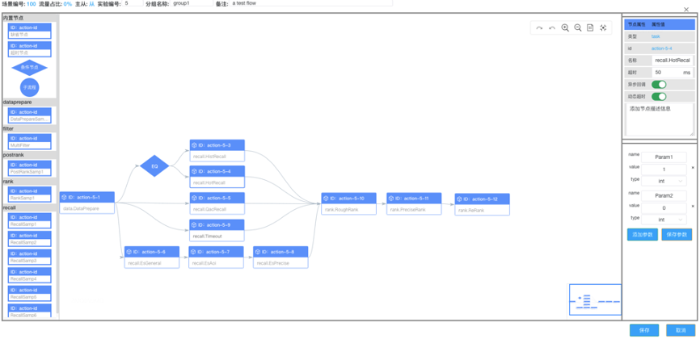

### 7.3 工作流配置发布

上一节中已存入数据库的工作流配置信息并不能自动发布到在线应用系统，需要在系统管理页面中点击"提交"按钮，将上述配置发布到一个具有存储全局配置功能的存储服务中，一般可基于zookeeper或redis开发，以供应用系统从配置中心读取上述配置信息。相应地，我们在工作流引擎也提供了从redis、zookeeper及本地文件中加载工作流配置的方法，前面工作流引擎接入部分已有介绍不作详述。

### 7.4 工作流导出与导入

然而，由于部分应用系统出于安全或者降低外部依赖的角度考虑，并不希望通过与后台管理系统进行联动的方式，动态更新工作流配置信息，因此我们在系统管理页面提供了工作流配置信息导出功能，用户可以直接将工作流配置信息导出为zip包，然后将上述zip包解压后直接添加到其应用系统的项目的本地目录下，应用系统在初始化工作流引擎时，可以直接使用工作流引擎提供的相关方法从本地目录加载工作流配置。